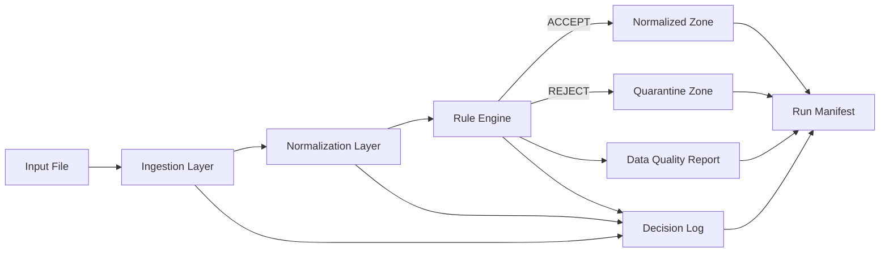

# AI Factory – Backoffice Admission Control Engine
## Arquitectura, Gobernanza y Decisiones de Diseño

---

## 1. Propósito Arquitectónico

Este componente no es un simple ETL.  
Es un **Admission Control Engine** diseñado bajo principios de:

- Auditabilidad total
- Gobernanza explícita
- Determinismo operacional
- Separación entre decisión y transformación
- Evidencia reproducible

Principio rector:

> Si una decisión no puede reconstruirse, no es válida en entorno bancario.

---

## 2. Qué Resuelve el Sistema

Procesa solicitudes de alta de productos provenientes de canales externos y aplica:

1. Ingesta controlada
2. Normalización determinística
3. Validación por reglas de elegibilidad
4. Quality Gate formal
5. Generación de evidencia auditada

---

## 3. Arquitectura Funcional

Interpretación bancaria:

- **Quarantine explícita** protege sistemas downstream.
- **Decision Log** permite reconstrucción por record_id.
- **Run Manifest** actúa como índice forense del lote.

---

## 4. Decisiones Arquitectónicas Clave

### 4.1 Separación de Intención y Registro

El evento (event) describe intención estable.
El message es humano.
El log es estructurado (JSONL).

Esto permite:

- Ingesta en SIEM
- Métricas por regla
- Auditoría por correlación

---

### 4.2 Quality Gate Formal

Política explícita:

invalid_rate <= 0.05

Esto introduce:

- Política versionable
- Decisión automatizada
- Trazabilidad entre métricas y decisión
- Estado degradado controlado (COMPLETED_WITH_WARNINGS)

---

### 4.3 Deterministic Run Identity

Cada ejecución genera:

run_key = timestamp + run_label + short_id

Esto permite:

- Reproducibilidad
- Identificación humana del lote
- Evidencia estable en filesystem

---

### 4.4 Manifest como Índice de Auditoría

El run_manifest.json contiene:

- Versión del pipeline
- Schema del manifiesto
- Hash SHA256 del input
- Catálogo de reglas
- Conteos agregados
- Resultado del Quality Gate
- Rutas relativas a artefactos
- Tiempo total de ejecución

Esto convierte cada corrida en una unidad auditable.

---

## 5. Qué Se Prefirió y Por Qué

### No usar frameworks pesados

El challenge no requiere orquestadores externos.
Se privilegió simplicidad efectiva y claridad estructural.

### No usar ML

El alcance es validación y control de datos.
Agregar ML sería ruido y sobre-ingeniería.

### No detener lote completo por registro inválido

Principio de continuidad operacional:
Un registro defectuoso no debe comprometer el lote completo.

---

## 6. Controles Diseñados para Escalar

Aunque no implementados por scope:

- Firma criptográfica del manifiesto
- Versionado formal de reglas
- Aprobación regulatoria por rule_version
- Almacenamiento WORM del decision log
- Métricas SLA por etapa
- Lineage formal input-output

---

## 7. Por Qué Esto Es Arquitectura Bancaria

El sistema implementa:

- Quarantine explícita
- Policy engine formal
- Evidence log estructurado
- Reproducibilidad
- Deterministic run identity
- Governance layer desacoplada

Esto no es scripting.
Es diseño orientado a control interno y cumplimiento.

---

## 8. Conclusión

La solución cumple el challenge y va más allá al introducir:

- Accountability explícita
- Control de calidad formal
- Evidencia verificable
- Diseño mantenible
- Extensibilidad controlada

Arquitectura mínima.
Arquitectura clara.
Arquitectura auditable.
