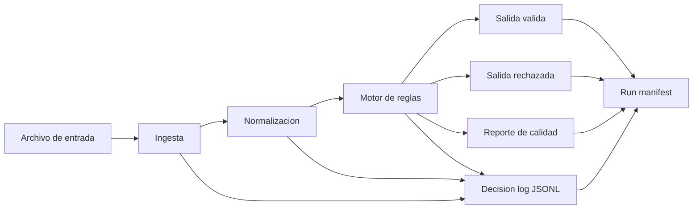

# Diseno Tecnico - Mini Workflow Supervisado (Backoffice)

## 1. Objetivo

Procesar solicitudes de alta de productos con un flujo simple, auditable y mantenible:
- Ingesta
- Normalizacion
- Validacion
- Control de calidad
- Evidencia (logs + reportes)

## 2. Arquitectura minima

## 3. Componentes

- `workflow.io`
  - Lee `csv`, `json`, `txt` delimitado y `cobol` fixed-width.
- `workflow.normalize`
  - Unifica fecha (`YYYY-MM-DD`), trimming y casing.
  - Deriva `risk_bucket`.
- `workflow.rules`
  - Reglas de elegibilidad simples y extensibles.
- `workflow.engine`
  - Evalua reglas y construye decision por registro.
- `workflow.quality`
  - Resume totales, detalle por regla y decision de quality gate.
- `workflow.audit`
  - Logging estructurado en JSONL con timestamp y nivel.
- `workflow.run`
  - Orquesta el pipeline y genera artefactos.

## 4. Estandares y convenciones

### Nombres
- `snake_case` para funciones/campos.
- `UPPER_CASE` para constantes.
- `rule_id` estable y legible (`REQUIRED_FIELDS`, `CURRENCY_ALLOWED`, etc.).

### Estructura
- `src/workflow/` para logica.
- `tests/` para validacion automatizada.
- `data/` para entradas de ejemplo.
- `artifacts/` para salidas de ejecucion.
- `docs/` para diseno.

### Logging
- Formato JSONL (`decision_log.jsonl`).
- Campos clave: `ts_utc`, `level`, `stage`, `event`, `run_id`, `record_id`, `rule_id`, `reason`.
- Niveles: `INFO`, `WARN`, `ERROR`.

### Manejo de errores
- `InputFormatError`: archivo invalido o formato no soportado.
- `NormalizationError`: dato invalido por registro.
- Estrategia: no cortar el lote por errores de registro, enviar a `rejected_requests.csv`.

### Supuestos
- Encoding: UTF-8/UTF-8-SIG.
- Fecha valida: `YYYY-MM-DD`.
- Monedas soportadas: `ARS`, `USD`, `EUR`.

## 5. Validaciones implementadas

1. Campos obligatorios presentes.
2. Moneda en lista permitida.
3. Monto dentro de rango.

## 6. Control de calidad

`data_quality_report.json` incluye:
- Totales (`total`, `valid`, `invalid`).
- Tasas (`acceptance_rate`, `rejection_rate`).
- Detalle por regla (`failed_count`, `pass_rate`, ejemplos).
- `failure_rate_by_rule`.
- `quality_gate` con politica versionada y decision (`PASS`/`WARN`).

## 7. Trazabilidad

Cada corrida genera:
- `decision_log.jsonl`
- `normalized_requests.csv`
- `rejected_requests.csv`
- `data_quality_report.json`
- `run_manifest.json`

El `run_manifest.json` consolida versiones, input hash, reglas aplicadas, metricas y rutas de artefactos.

## 8. Supervisión técnica

### Mantenibilidad
- Modulos pequenos y con responsabilidad unica.
- Reglas desacopladas de la orquestacion.
- Contratos de datos tipados (`dataclasses`).

### En code review revisaria
- Correctitud de normalizacion (sin transformar semantica).
- Claridad de mensajes de error y trazabilidad.
- Estabilidad de `rule_id` y compatibilidad de reportes.
- Cobertura de tests por formato y flujo E2E.

### Riesgos y mitigaciones
- Entrada con formato ambiguo.
  - Mitigacion: `--format` explicito + validacion temprana.
- Datos faltantes o corruptos.
  - Mitigacion: errores controlados por registro + cuarentena.
- Inconsistencia entre version de codigo y artefactos.
  - Mitigacion: versionado unico en pipeline/manifest y pruebas E2E.

## 9. Escalabilidad simple

Siguientes pasos naturales:
- Catalogo versionado de reglas por ambiente.
- Persistencia de logs en sistema centralizado.
- Trazabilidad cruzada con origen de canal.
- Suite de regresion con datasets sinteticos por formato legacy.
